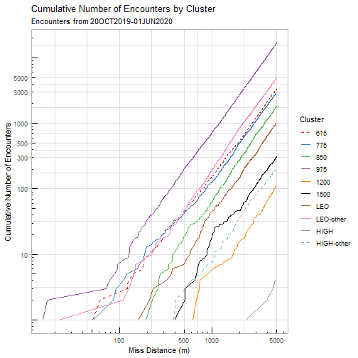
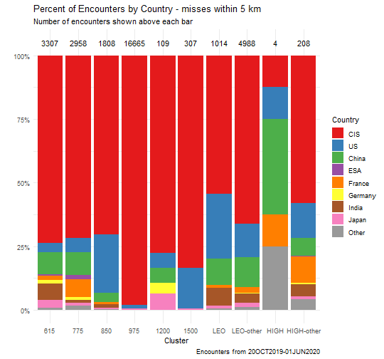
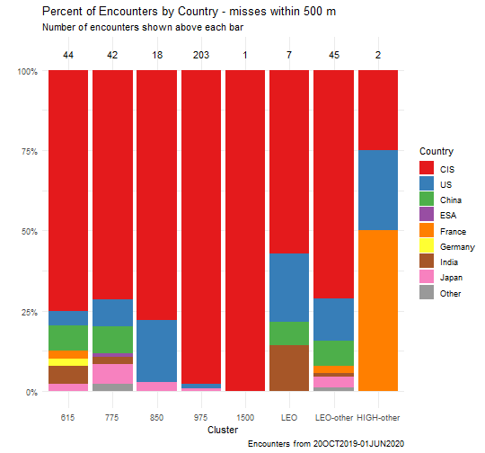
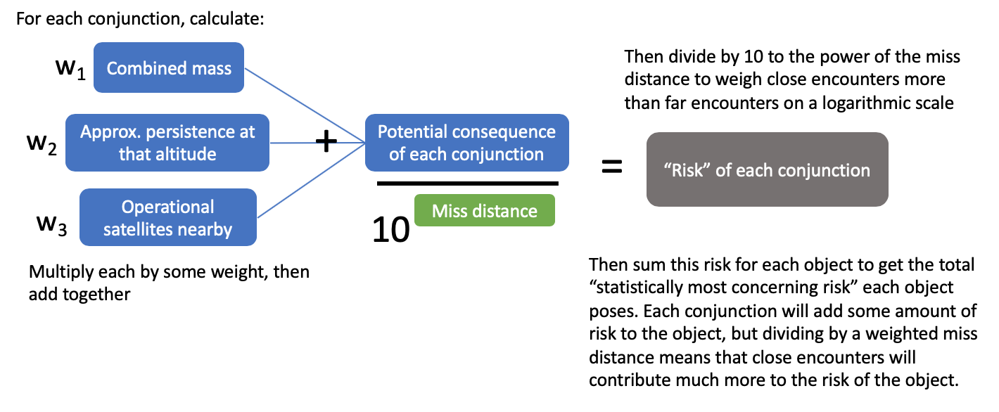

## Miss distance vs cumulative count plot


## Percent of Encounters by Country






## Worst offender analysis-- Method 1




Current list of top 50 objects with highest risk:

```
## Error in file(con, "rb"): cannot open the connection
```

- `num conjs` is the total number of conjunctions (<5km) the object has been in (since 20OCT2019)
- `avg num op sats` is the average number of operational satellites within 100 km above or below each conjunction
- `avg persist of conj alt` is the average persistence (in years) of debris produced at the altitude of encounters (a rough approximation based on altitude)
- `num encounters <1 km` is the number of encounters below 1 km miss distance

### Risk among all derelicts
Among all derelicts, percent of risk accounted for by each cluster:


## Worst offender analysis-- Method 2

The second method for calculating the top 50 statistically most concerning objects also uses the idea that risk = probability * consequence, although it slightly differs from the first method in what components make up probability and consequence.

Probability:

- CR = annual collision rate of each cluster
  * Each cluster of massive derelicts has an annual collision rate
- AR = cross-sectional area of object (estimated by multiplying mass by 0.005)
  * The larger cross-sectional area, the larger the likelihood of colliding
- E5 = number of encounters < 5 km per year
- E1 = number of encounters < 1 km per year

Consequence:

- MF = $\frac{mass~of~object}{1500}$
  * Mass is proportional to the amount of debris produced (mass ranges from 700-9000 kg)
  * Divide by 1500 so that objects below 1500 kg bring risk down while larger masses increase risk
- DF = $\frac{atmospheric~density ~at~ 500~km}{atmospheric~density~at ~object's ~avg. ~altitude}$ 
  * There's a higher consequence for debris that linger for a longer amount of time, and orbital lifetime of resulting debris is proportional to atmospheric density (which decreases exponentially with increasing altitude).
  * Averaged across each cluster
- SD = spatial density of operational satellites
  * Consequence is higher when there are more operational satellites in the vacinity
  * Averaged across each cluster

Then for each object, the risk is calculated as:
$$Risk = [CR * AR * {E5/25 * (5 * E1)}] * [MF * DF * SD]$$


Summary of key measures per cluster: 


<table class="table" style="margin-left: auto; margin-right: auto;">
 <thead>
  <tr>
   <th style="text-align:left;"> cluster </th>
   <th style="text-align:right;"> numDerelicts </th>
   <th style="text-align:right;"> avgMass </th>
   <th style="text-align:left;"> CR </th>
   <th style="text-align:right;"> DF </th>
   <th style="text-align:right;"> SD </th>
  </tr>
 </thead>
<tbody>
  <tr>
   <td style="text-align:left;"> cc615 </td>
   <td style="text-align:right;"> 165 </td>
   <td style="text-align:right;"> 1,847.1 </td>
   <td style="text-align:left;"> 1.5e-03 </td>
   <td style="text-align:right;"> 25 </td>
   <td style="text-align:right;"> 538 </td>
  </tr>
  <tr>
   <td style="text-align:left;"> cc775 </td>
   <td style="text-align:right;"> 154 </td>
   <td style="text-align:right;"> 1,574.1 </td>
   <td style="text-align:left;"> 1.4e-03 </td>
   <td style="text-align:right;"> 90 </td>
   <td style="text-align:right;"> 346 </td>
  </tr>
  <tr>
   <td style="text-align:left;"> cc850 </td>
   <td style="text-align:right;"> 97 </td>
   <td style="text-align:right;"> 3,257.9 </td>
   <td style="text-align:left;"> 2.4e-03 </td>
   <td style="text-align:right;"> 150 </td>
   <td style="text-align:right;"> 69 </td>
  </tr>
  <tr>
   <td style="text-align:left;"> cc975 </td>
   <td style="text-align:right;"> 355 </td>
   <td style="text-align:right;"> 1,176.4 </td>
   <td style="text-align:left;"> 8.2e-03 </td>
   <td style="text-align:right;"> 1,000 </td>
   <td style="text-align:right;"> 17 </td>
  </tr>
  <tr>
   <td style="text-align:left;"> cc1200 </td>
   <td style="text-align:right;"> 40 </td>
   <td style="text-align:right;"> 1,397.6 </td>
   <td style="text-align:left;"> 3.3e-05 </td>
   <td style="text-align:right;"> 1,600 </td>
   <td style="text-align:right;"> 26 </td>
  </tr>
  <tr>
   <td style="text-align:left;"> cc1500 </td>
   <td style="text-align:right;"> 73 </td>
   <td style="text-align:right;"> 1,311.4 </td>
   <td style="text-align:left;"> 1.2e-04 </td>
   <td style="text-align:right;"> 1,800 </td>
   <td style="text-align:right;"> 56 </td>
  </tr>
  <tr>
   <td style="text-align:left;"> cleo </td>
   <td style="text-align:right;"> 196 </td>
   <td style="text-align:right;"> 1,788.1 </td>
   <td style="text-align:left;"> 3.3e-04 </td>
   <td style="text-align:right;"> 150 </td>
   <td style="text-align:right;"> 103 </td>
  </tr>
  <tr>
   <td style="text-align:left;"> CHIGH </td>
   <td style="text-align:right;"> 188 </td>
   <td style="text-align:right;"> 3,028.8 </td>
   <td style="text-align:left;"> 2.5e-07 </td>
   <td style="text-align:right;"> 1,000 </td>
   <td style="text-align:right;"> 3 </td>
  </tr>
</tbody>
</table>

Note: values for CR, DF, and SD are used ona cluster level, meaning that all objects within a cluster have the same value for these three measures.

Top 50 statistically most concerning objects:


```
## Error in file(con, "rb"): cannot open the connection
```


### Risk among all derelicts
Among all derelicts, percent of risk accounted for by each cluster:


